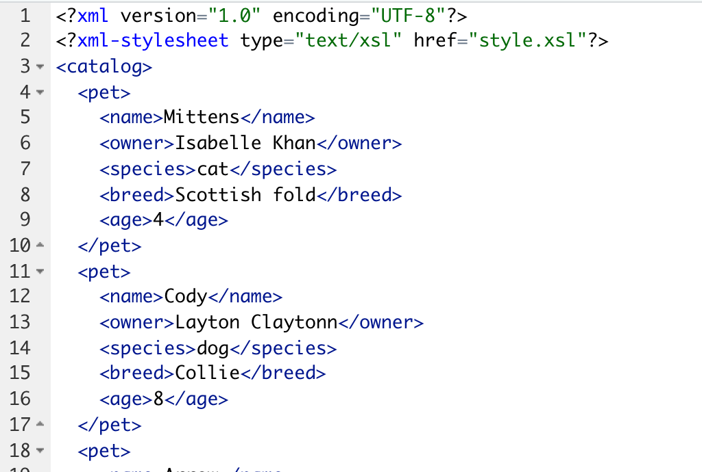

One of the rather idiosyncratic things about working in pharma (although I am sure this is true for other highly regulated environments) is systems stay around for a while before they are replaced. Because of these old systems, this week I ran into the need to read in a bunch of tables from an xml document. For those who have never used an xml document, technically there isn't such as thing as a table, but style sheets can be used to create tables. So you get something that looks like this when the xml is opened in a browser:


But, if you look at xml in a text editor you get something like this: 



There are two main packages in R to handle xml files, XML and xml2. XML is the older package and contains a bunch of functions. xml2 is the RStudio backed xml package. It has fewer functions, but it quite slick with good documentation. 

I stuck with XML for my project because I found it easier to navigate the XML file I was using. 
The first step to reading in your table is to read in the document using the xmlParse function. 
```{r message=FALSE}
library(XML)
library(purrr)
library(dplyr)
doc <- xmlParse("data/document.xml")
class(doc)
```
This creates an XMLInternalDocument, which we can get information from. 

Before we can get too far into making a dataframe out of the xml file, we need to understand a bit more about how xml files are structured. Basically, xml files are just trees. Everything in the xml is part of the tree and you need to use xpath, the xml selection language, in order to find the branch/leaf you are looking for. 

From looking at the xml file we can see catalog is the highest level in the tree, followed by pet, and then information about the pet. 

For my table I want get all the pet information in the pet lowest node. So I am going to use the `getNodeSet` function, which will return a list of nodes. In this case each node will be all the information about one pet 
```{r}
pet_list <- getNodeSet(doc, "//catalog/pet")
pet_list[[1]]
```
Now that I have all the nodes I want in list I am able to convert the list to a dataframe using `xmlToDataFrame`.
```{r}
xmlToDataFrame(nodes = pet_list)
```
More complicated xml documents will split information between attributes and elements. In this dummy example we can see the name, which was an element before is now a name attribute.  
```{r}
mix_doc <- xmlParse("data/document2.xml")
pet_list <- getNodeSet(mix_doc, "//catalog/pet")
pet_list[1]
```
This means that if we do the same thing we did above, we would not get the pet's name in our dataset. 
```{r}
xmlToDataFrame(nodes = pet_list)
```

To get the pet's name we will need to get the information from the attribute as well as the elements.
For the names we will use the `xmlAttrs` function to get the name attribute from each node. Unlike, the `xmlToDataFrame` function `xmlAttrs` expects a node rather than a node set. To ensure only a node is passed we will use `map_chr` with `xmlAttrs` to get the names out. 

For the information in the elements, we can use the `xmlToDataFrame` as before.
```{r}
xmlToDataFrame(nodes = pet_list) %>% 
  mutate(pet = pet_list %>% 
           map_chr(xmlAttrs, "name"))
```

With these functions (along with `xmlValue`, which can be quite helpful), you can parse most xml's you'll run across. I think the biggest thing I learned when working with xml, is to look at the data. Cause xml is a tree, if you get the wrong branch nothing will make sense. So looking at the data is super helpful when debugging the xpath and when figuing out what information is an element and what is an attribute. 